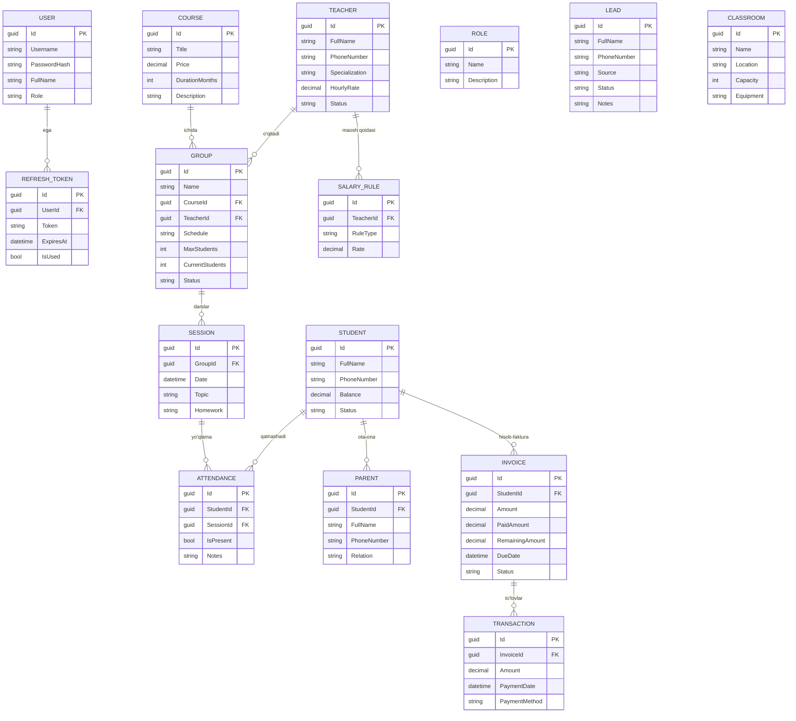

# EduCRM Pro

Ta'lim markazlari (o'quv markaz / IT akademiya / repetitorlik) uchun CRM tizimi.
Maqsad — leadlardan tortib o'quvchi, guruh, davomat va to'lovlargacha bo'lgan jarayonni
bitta joydan boshqarish. Backend **ASP.NET Core 9 (Clean Architecture)**, frontend esa
**React + TypeScript + Vite** asosida qurilgan.

**MVP modullari:** Autentifikatsiya (JWT), Dashboard, Leadlar, O'quvchilar, Kurslar,
Guruhlar, Davomat (darslar), To'lovlar.

---

## Texnologiyalar va maqsadlari

### Backend (`src/`) — ASP.NET Core 9, Clean Architecture

| Texnologiya | Versiya | Maqsadi |
| ----------- | ------- | ------- |
| **ASP.NET Core Web API** | 9.0 | REST API qatlami — controllerlar, routing, DI, middleware |
| **Entity Framework Core** | 9.0 | ORM — bazaga obyektlar orqali murojaat qilish |
| **EF Core SQLite** | 9.0 | MVP uchun yengil, fayl-asosli ma'lumotlar bazasi (`educrm.db`) |
| **MediatR** | 14.1 | CQRS namunasi — har bir amal `Query`/`Command` + `Handler` ko'rinishida |
| **FluentValidation** | 12.1 | Kiruvchi so'rovlarni validatsiya qilish (masalan, bo'sh maydon → 400) |
| **AutoMapper** | 16.1 | Entity ↔ DTO o'girish |
| **JWT (JwtBearer)** | 9.0 | Token-asosli autentifikatsiya (15 daqiqa access, refresh token) |
| **Serilog** | 10.0 | Strukturalangan loglash (fayl sink) |
| **Swashbuckle / Swagger** | 7.2 | API hujjati va sinov UI (`/swagger`) |

> `Hangfire`, `Redis`, `PostgreSQL` paketlari kelajakdagi kengaytmalar (fon vazifalar,
> kesh, prod baza) uchun qo'shilgan, MVP'da SQLite ishlatiladi.

**Qatlamlar (Clean Architecture):**

| Loyiha | Vazifasi |
| ------ | -------- |
| `EduCRM.Domain` | Entitilar (biznes obyektlari) — hech qanday tashqi bog'liqliksiz |
| `EduCRM.Application` | CQRS handlerlar, DTO, validatorlar, interfeyslar |
| `EduCRM.Infrastructure` | `DbContext`, EF konfiguratsiyasi, `DbSeeder`, servislar |
| `EduCRM.API` | Controllerlar, middleware (xato → HTTP kodi), DI sozlash |

### Frontend (`frontend/`) — React + TypeScript

| Texnologiya | Versiya | Maqsadi |
| ----------- | ------- | ------- |
| **React** | 19 | UI komponentlari va holatni boshqarish |
| **TypeScript** | 6.x | Tip xavfsizligi |
| **Vite** | 8 | Tez dev-server va build vositasi |
| **Tailwind CSS** | 4.3 | Utility-first stillar (`@tailwindcss/vite` plagini orqali) |
| **React Router** | 7 | Sahifalar o'rtasida navigatsiya (`/courses`, `/groups`, ...) |
| **Axios** | 1.7 | API'ga so'rov; interceptor JWT tokenni avtomatik qo'shadi |

---

## Ma'lumotlar bazasi — ER diagramma



> Har bir jadval `BaseEntity` dan meros oladi: `Id` (Guid, PK), `CreatedAt`, `UpdatedAt`.
> Diagramma GitHub'da avtomatik chiziladi (Mermaid qo'llab-quvvatlanadi).

### Asosiy bog'lanishlar (qisqacha)

- **Course → Group → Session → Attendance:** kurs ichida guruhlar, guruhda darslar (session),
  har bir darsda o'quvchilar yo'qlamasi (attendance).
- **Teacher → Group:** o'qituvchi guruhga biriktiriladi; `SalaryRule` orqali maosh qoidasi.
- **Student → Invoice → Transaction:** o'quvchiga hisob-faktura, har bir faktura bo'yicha to'lovlar.
- **User → RefreshToken:** autentifikatsiya uchun token boshqaruvi.

> **Eslatma (MVP):** `LEAD`, `ROLE` va `CLASSROOM` jadvallari mavjud, lekin hozircha
> ular boshqa jadvallarga FK orqali bog'lanmagan. Masalan, "Lead → Student" — bu DB
> kalitida emas, biznes jarayonida (lead ro'yxatdan o'tib o'quvchiga aylanadi) sodir bo'ladi.
> `User.Role` esa string sifatida saqlanadi (alohida `Role` jadvaliga FK emas).

---

## Talablar

- [.NET SDK 9](https://dotnet.microsoft.com/download)
- [Node.js 20+](https://nodejs.org)

## Ishga tushirish

### 1. Backend (API) — `http://localhost:5000`

```bash
cd src/EduCRM.API
dotnet run
```

Birinchi ishga tushishda SQLite bazasi (`educrm.db`) avtomatik yaratiladi va boshlang'ich
ma'lumotlar (admin foydalanuvchi va namuna ma'lumotlar) bilan to'ldiriladi.

Swagger: `http://localhost:5000/swagger`

### 2. Frontend — `http://localhost:5173`

Yangi terminalda:

```bash
cd frontend
npm install
npm run dev
```

Brauzerda `http://localhost:5173` ni oching.

## Kirish ma'lumotlari (seed)

| Login | Parol    |
| ----- | -------- |
| admin | admin123 |

## Loyiha tuzilishi

```
src/
├── EduCRM.Domain          # Entities (biznes obyektlari)
├── EduCRM.Application      # CQRS (MediatR), Validators, DTOs
├── EduCRM.Infrastructure   # DbContext, Services, DbSeeder
└── EduCRM.API              # Controllers, Middleware, DI
frontend/
└── src/                    # pages, components, services, context
```

## Eslatma

- API porti (`5000`) frontend (`src/services/api.ts`) va CORS sozlamalari bilan moslangan.
- Konfiguratsiya `src/EduCRM.API/appsettings.json` da (JWT kaliti, ulanish satri).
  Production uchun JWT `SecretKey` ni almashtiring.
